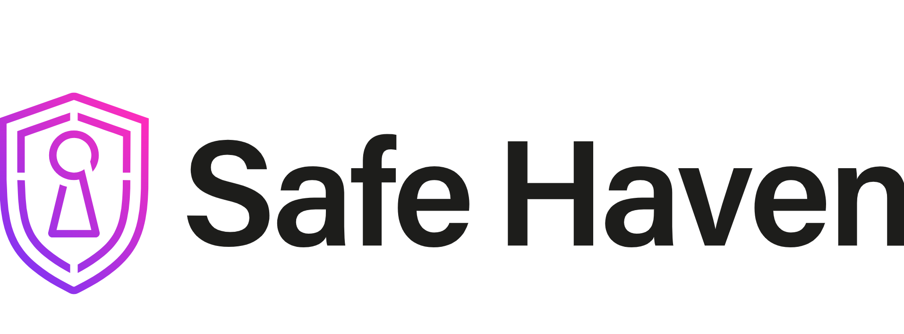

  

    

**SafeHaven Cybersecurity**  
1234 Cyber St, Secure City, SC 56789

---

# Welcome to SafeHaven Cybersecurity ISMS

Welcome to the **SafeHaven Cybersecurity Information Security Management System (ISMS)** website! This site provides a comprehensive overview of our cybersecurity policies, standards, and practices designed to protect sensitive data and manage cybersecurity risks effectively.

---

## Introduction

At SafeHaven, we are dedicated to providing top-notch cybersecurity solutions tailored for small businesses. Our goal is to make robust security accessible and manageable, allowing organizations to focus on growth while we take care of security.

---

## Why Choose SafeHaven

SafeHaven Cybersecurity is uniquely positioned to address the security needs of small businesses. Here’s why we stand out:

- **Expertise**: Our team comprises cybersecurity professionals with extensive industry experience.
- **Tailored Solutions**: We design security frameworks specifically for small businesses, ensuring they’re both scalable and effective.
- **Compliance-Focused**: Our ISMS aligns with industry standards like HIPAA, PCI-DSS, FFIEC, and SOC 2, keeping you compliant and secure.
- **24/7 Support**: We offer continuous monitoring and support to respond to incidents swiftly and effectively.

Choose SafeHaven for a reliable, comprehensive approach to cybersecurity.

---

## Mission Statement

Our mission at SafeHaven Cybersecurity is to empower small businesses by safeguarding their digital assets through comprehensive, scalable, and affordable security solutions.

We are committed to:

- **Protecting Data**: Ensuring your data remains confidential, integral, and available.
- **Mitigating Risks**: Proactively assessing and managing cybersecurity risks to minimize threats.
- **Promoting Compliance**: Aligning with industry standards to help businesses stay compliant with regulations and build trust with their clients.
- **Fostering Resilience**: Creating a culture of cybersecurity awareness, enabling businesses to recover swiftly and effectively from any incident.

SafeHaven Cybersecurity – making security simple, strong, and sustainable.

## Explore our policies, compliance standards, and operational security strategies to understand how we protect your business.

